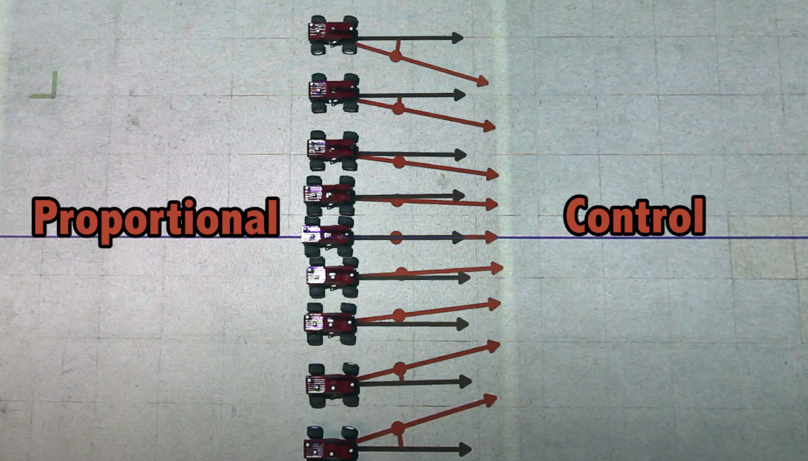

# CarND-Controls-PID
Self-Driving Car Engineer Nanodegree Program

---

(Images from [MIT video](https://youtu.be/4Y7zG48uHRo))
## Feedback signal

The **cross-track error** is the source error of the PID controllers.

For the main PID controller, the output is the steering angle. The `reference` for this controller is `0`, as we aim to always stay at the center of the line.

Another PID controller was implemented for the speed, this controller was implemented in a slightly different way to slow down the vehicle in tricky situations being the speed output calculated as `throttle = setSpeed - abs(PID_output)` 


### P controller

<table>
    <tr>
        <td>
            
        </td>
        <td>
            
        </td>
    </tr>
</table>

### PD controller

<table>
    <tr>
        <td>
            
        </td>
        <td>
            
        </td>
    </tr>
</table>


## PID controller

<table>
    <tr>
        <td>
            
        </td>
        <td>
            
        </td>
    </tr>
</table>


## Anti Windup

Although it is highly unlikely we enter in windup situations in this particular controller it is always nice to implement anti-windup methods to saturate the integral part and the output.

The images and code below were obtained from [here](http://brettbeauregard.com/blog/2011/04/improving-the-beginner%E2%80%99s-pid-reset-windup/) they are pretty well self-explanatory.

<table>
    <tr>
        <td>
            
        </td>
        <td>
            
        </td>
    </tr>
</table>

The implementation looks like this: 

```
void SetOutputLimits(double Min, double Max)
{
   if(Min > Max) return;
   outMin = Min;
   outMax = Max;
    
   if(Output > outMax) Output = outMax;
   else if(Output < outMin) Output = outMin;
 
   if(ITerm> outMax) ITerm= outMax;
   else if(ITerm< outMin) ITerm= outMin;
}
```


## Twiddle

## Dependencies

* cmake >= 3.5
 * All OSes: [click here for installation instructions](https://cmake.org/install/)
* make >= 4.1(mac, linux), 3.81(Windows)
  * Linux: make is installed by default on most Linux distros
  * Mac: [install Xcode command line tools to get make](https://developer.apple.com/xcode/features/)
  * Windows: [Click here for installation instructions](http://gnuwin32.sourceforge.net/packages/make.htm)
* gcc/g++ >= 5.4
  * Linux: gcc / g++ is installed by default on most Linux distros
  * Mac: same deal as make - [install Xcode command line tools]((https://developer.apple.com/xcode/features/)
  * Windows: recommend using [MinGW](http://www.mingw.org/)
* [uWebSockets](https://github.com/uWebSockets/uWebSockets)
  * Run either `./install-mac.sh` or `./install-ubuntu.sh`.
  * If you install from source, checkout to commit `e94b6e1`, i.e.
    ```
    git clone https://github.com/uWebSockets/uWebSockets 
    cd uWebSockets
    git checkout e94b6e1
    ```
    Some function signatures have changed in v0.14.x. See [this PR](https://github.com/udacity/CarND-MPC-Project/pull/3) for more details.
* Simulator. You can download these from the [project intro page](https://github.com/udacity/self-driving-car-sim/releases) in the classroom.

Fellow students have put together a guide to Windows set-up for the project [here](https://s3-us-west-1.amazonaws.com/udacity-selfdrivingcar/files/Kidnapped_Vehicle_Windows_Setup.pdf) if the environment you have set up for the Sensor Fusion projects does not work for this project. There's also an experimental patch for windows in this [PR](https://github.com/udacity/CarND-PID-Control-Project/pull/3).

## Basic Build Instructions

1. Clone this repo.
2. Make a build directory: `mkdir build && cd build`
3. Compile: `cmake .. && make`
4. Run it: `./pid`. 

Tips for setting up your environment can be found [here](https://classroom.udacity.com/nanodegrees/nd013/parts/40f38239-66b6-46ec-ae68-03afd8a601c8/modules/0949fca6-b379-42af-a919-ee50aa304e6a/lessons/f758c44c-5e40-4e01-93b5-1a82aa4e044f/concepts/23d376c7-0195-4276-bdf0-e02f1f3c665d)

## Editor Settings

We've purposefully kept editor configuration files out of this repo in order to
keep it as simple and environment agnostic as possible. However, we recommend
using the following settings:

* indent using spaces
* set tab width to 2 spaces (keeps the matrices in source code aligned)

## Code Style

Please (do your best to) stick to [Google's C++ style guide](https://google.github.io/styleguide/cppguide.html).